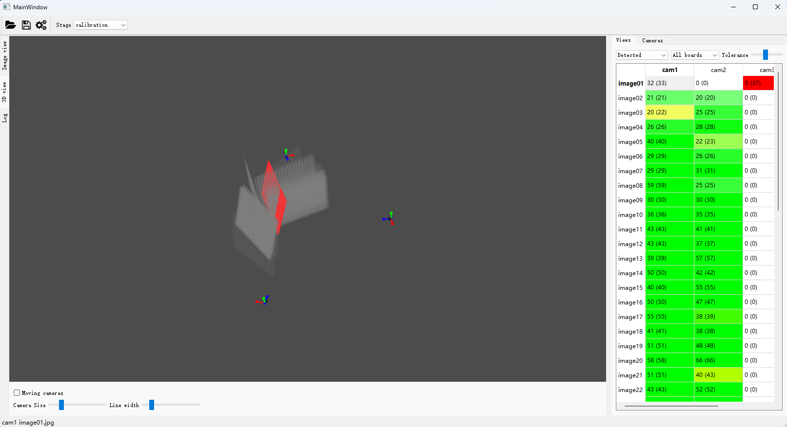
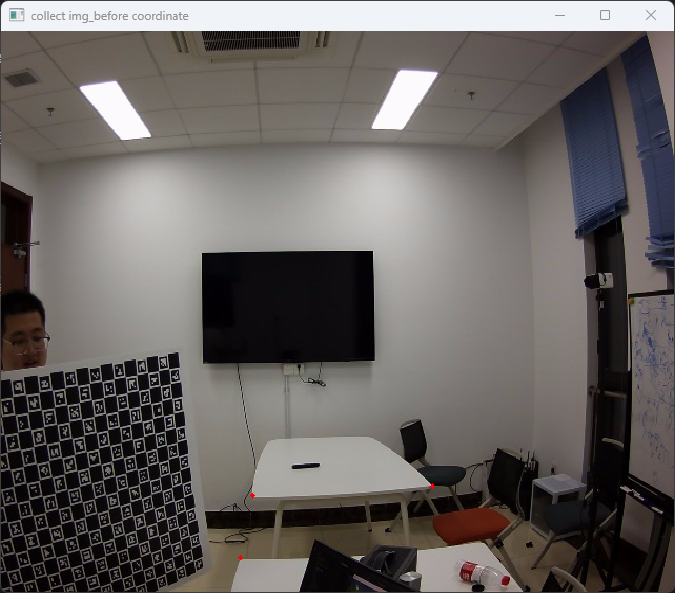
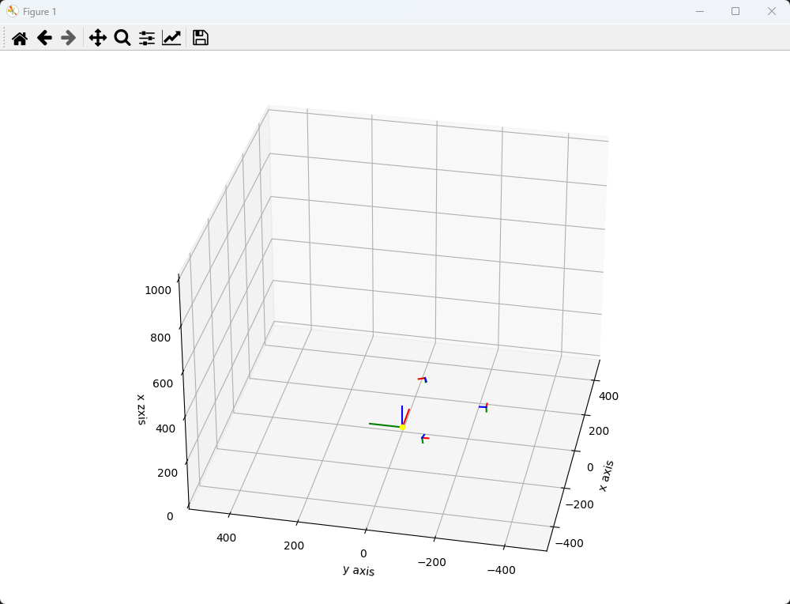

## 多相机校准工具Camera-Calibration

#### 程序原理：
[相机模型、校准原理](./camera_calibration_principle/相机模型校准原理.md)
[相机参数转换](https://blog.csdn.net/ustczhng2012/article/details/120177812)
[求解PnP问题](https://www.jianshu.com/p/ce4d05d13cb4)
[从相对外参到绝对外参](./camera_calibration_principle/windows环境配置.md)

#### 环境配置
[Windows](./camera_calibration_principle/windows环境配置.md)
[Ubuntu](./camera_calibration_principle/ubuntu环境配置.md)
[配置环境的 BUG Log](./camera_calibration_principle/bugRecord.md)


#### Camera-Calibration的调用
```shell
python main.py
# 所有程序的行为控制都在 config.py文件中
```

#### Camera-Calibration功能简介
1. 生成校准板
2. 多视角拍摄校准图片
3. 计算各视角相机参数（内参、外参、畸变系数）
4. 可视化世界坐标系

#### 运行Demo

解压img_collect.7z
覆盖 img_collect 文件夹
修改 config 文件`config.recollect=False`
运行`python main.py`

#### 程序运行截图







