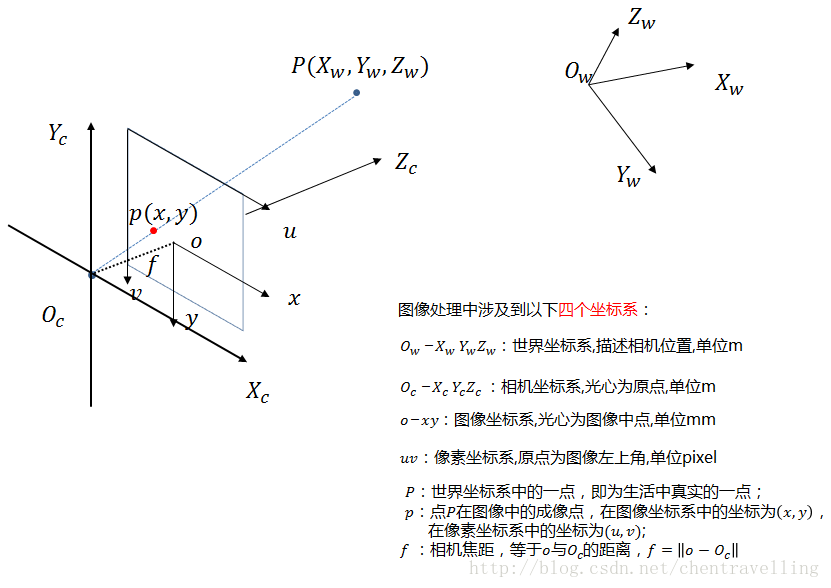
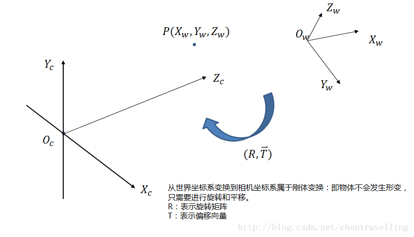
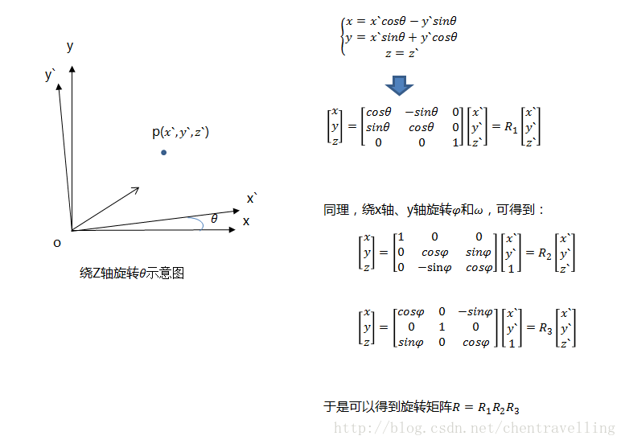
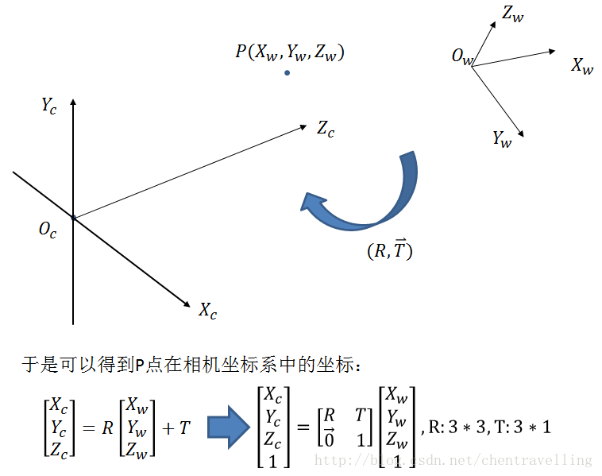
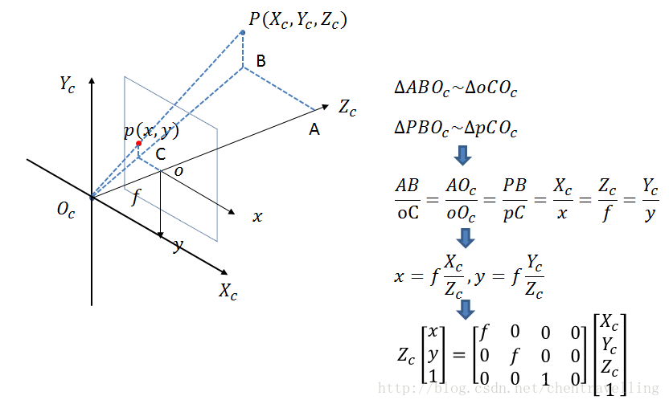
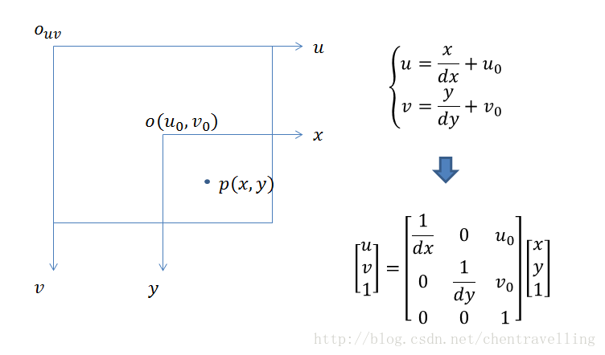
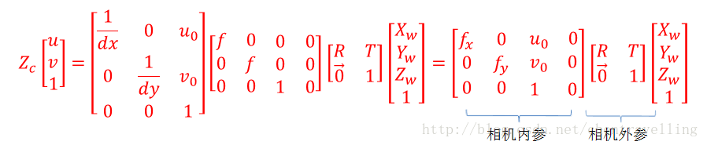

> https://cloud.tencent.com/developer/article/1820935

【相机标定】四个坐标系之间的变换关系

世界坐标系，相机坐标系，图像物理坐标系，像素坐标系之间的关系：

首先看下几个坐标系在放在一块的样子：

1：世界坐标系：根据情况而定，可以表示任何物体，此时是由于相机而引入的。单位m。

2：相机坐标系：以摄像机光心为原点（在针孔模型中也就是针孔为关心），z轴与光轴重合也就是z轴指向相机的前方（也就是与成像平面垂直），x轴与y轴的正方向与物体坐标系平行，其中上图中的f为摄像机的焦距。单位m

3：图像物理坐标系（也叫平面坐标系）：用物理单位表示像素的位置，坐标原点为摄像机光轴与图像物理坐标系的交点位置。坐标系为图上o-xy。单位是mm。单位毫米的原因是此时由于相机内部的CCD传感器是很小的，比如8mm x 6mm。但是最后图像照片是也像素为单位比如640x480.这就涉及到了图像物理坐标系与像素坐标系的变换了。下面的像素坐标系将会讲到。

4：像素坐标系：以像素为单位，坐标原点在左上角。这也是一些opencv，OpenGL等库的坐标原点选在左上角的原因。当然明显看出CCD传感器以mm单位到像素中间有转换的。举个例子，CCD传感上上面的8mm x 6mm，转换到像素大小是640x480. 假如dx表示像素坐标系中每个像素的物理大小就是1/80. 也就是说毫米与像素点的之间关系是piexl/mm.

好了四个坐标系都解释完了，接下来就说下各个坐标系中间的变换关系吧。

一：世界坐标到相机坐标系

物体之间的坐标系变换都可以表示坐标系的旋转变换加上平移变换，则世界坐标系到相机坐标系的转换关系也是如此。绕着不同的轴旋转不同的角度得到不同的旋转矩阵。如下：

那么世界坐标系到相机坐标系的变换如下：

二：相机坐标系到图像物理坐标系

从相机坐标系到图像坐标系，属于透视投影关系，从3D转换到2D。也可以看成是针孔模型的改变模型。满足三角形的相似定理。

三：图像物理坐标系到像素坐标系。

此时与前面的坐标系变换不同，此时没有旋转变换，但是坐标原点位置不一致，大小不一致，则设计伸缩变换及平移变换。

综上所述，大家可以看出四个坐标系之间存在着下述关系 ( 矩阵依次左乘 )

**其中相机的内参和外参可以通过张正友标定获取。通过最终的转换关系来看，一个三维中的坐标点，的确可以在图像中找到一个对应的像素点，但是反过来，通过图像中的一个点找到它在三维中对应的点就很成了一个问题，因为我们并不知道等式左边的Zc的值。** 
